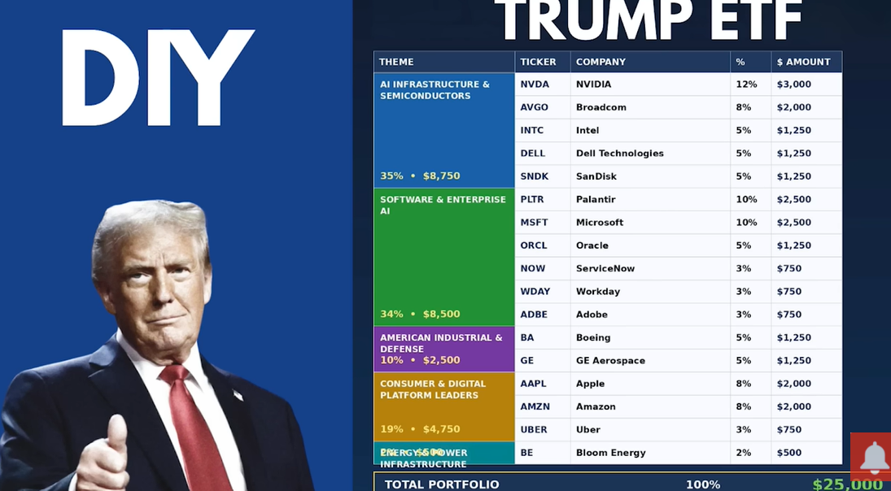

Reference : https://www.youtube.com/watch?v=fbn64JV-hXU 

# Moomoo Time-Series Momentum Trading Bot 📈

A professional-grade algorithmic scanner built on top of the official Futu/Moomoo OpenD API wrapper. This system analyzes structured historical time-series data to execute momentum-driven trend strategies across a custom equities watchlist.

---

## 🚀 Strategy Architecture

The execution engine evaluates market structure over a rolling **120-day historical time frame** using dual-layered mathematical indicators:

1. **Structural Trend Direction**: Computes exponential moving averages (**EMA 12** vs **EMA 50**) on daily candlesticks to identify systematic, high-conviction trend crossovers.
2. **Velocity Multiplier**: Calculates a 21-trading-day (~1 calendar month) **Rate of Change (ROC)** matrix to verify underlying transaction velocity.

### 📐 Execution Rules
* **BUY Trigger**: Occurs when a *bullish crossover* finishes (EMA 12 passes above EMA 50) and 1-month momentum is strictly positive (`ROC_1M > 0`).
* **SELL Trigger**: Occurs instantly if a *bearish crossover* materializes (EMA 12 falls beneath EMA 50) **OR** the asset's monthly momentum declines rapidly (`ROC_1M < -5`).

---

## 🛠️ Performance & Runtime Verification

Below is an active pipeline log tracking operational asset evaluation, quota consumption metrics, and risk-managed execution signals.

```text
===========================================================================
               MOOMOO API QUOTA & ACCOUNT DIAGNOSTICS              
===========================================================================
 -> Used Quota Stock Count : 17
 -> Remaining Stock Quota  : 1983
===========================================================================

===========================================================================
               MOOMOO MOMENTUM SCANNER (DRY RUN ONLY)              
===========================================================================
SYMBOL     | CLOSE     | 1M MOMENTUM  | SIGNAL   | PROPOSED ORDER
---------------------------------------------------------------------------
US.NVDA    | $219.51  |       8.40% | HOLD     | No Action Required
US.AVGO    | $414.57  |      -1.91% | HOLD     | No Action Required
US.INTC    | $118.50  |      81.55% | HOLD     | No Action Required
US.DELL    | $252.80  |      17.77% | HOLD     | No Action Required
US.SNDK    | $1542.24 |      57.52% | HOLD     | No Action Required
US.PLTR    | $137.41  |      -9.96% | SELL     | ⚠️ DRY RUN: Would SELL 10 shares @ $137.41
US.MSFT    | $419.09  |      -2.98% | HOLD     | No Action Required
US.ORCL    | $189.77  |       1.21% | HOLD     | No Action Required
US.NOW     | $99.69   |      -3.28% | HOLD     | No Action Required
US.WDAY    | $121.85  |      -3.75% | HOLD     | No Action Required
US.ADBE    | $244.10  |      -4.63% | HOLD     | No Action Required
US.BA      | $219.61  |      -5.05% | SELL     | ⚠️ DRY RUN: Would SELL 10 shares @ $219.61
US.GE      | $301.76  |       9.22% | HOLD     | No Action Required
US.AAPL    | $304.99  |      11.75% | HOLD     | No Action Required
US.AMZN    | $268.46  |       5.13% | HOLD     | No Action Required
US.UBER    | $73.61   |      -2.61% | SELL     | ⚠️ DRY RUN: Would SELL 10 shares @ $73.61
US.BE      | $307.88  |      34.01% | HOLD     | No Action Required
===========================================================================
ALGORITHM SCAN COMPLETE: API contexts cleanly terminated.
===========================================================================
```

---

## 💻 Technical Implementation

```python
import pandas as pd
import numpy as np
from moomoo import *
import time
from datetime import datetime, timedelta

OPEND_HOST = "127.0.0.1"
OPEND_PORT = 11113
SHARE_QUANTITY_PER_ORDER = 10

MY_WATCHLIST = [
    "US.NVDA", "US.AVGO", "US.INTC", "US.DELL", "US.SNDK",
    "US.PLTR", "US.MSFT", "US.ORCL", "US.NOW", "US.WDAY",
    "US.ADBE", "US.BA", "US.GE", "US.AAPL", "US.AMZN",
    "US.UBER", "US.BE"
]

def evaluate_daily_momentum(df):
    if len(df) < 55:
        return "HOLD"

    df['EMA12'] = df['close'].ewm(span=12, adjust=False).mean()
    df['EMA50'] = df['close'].ewm(span=50, adjust=False).mean()
    df['ROC_1M'] = df['close'].pct_change(periods=21) * 100

    latest_bar = df.iloc[-1]
    prior_bar = df.iloc[-2]

    is_bullish_crossover = (prior_bar['EMA12'] <= prior_bar['EMA50']) and (latest_bar['EMA12'] > latest_bar['EMA50'])
    is_bearish_crossover = (prior_bar['EMA12'] >= prior_bar['EMA50']) and (latest_bar['EMA12'] < latest_bar['EMA50'])

    if is_bullish_crossover and latest_bar['ROC_1M'] > 0:
        return "BUY"
    elif is_bearish_crossover or latest_bar['ROC_1M'] < -5:
        return "SELL"

    return "HOLD"

def print_moomoo_quota_status(quote_ctx):
    print("=" * 75)
    print("               MOOMOO API QUOTA & ACCOUNT DIAGNOSTICS              ")
    print("=" * 75)
    ret_code, data = quote_ctx.get_history_kl_quota()
    if ret_code == RET_OK:
        print(f" -> Used Quota Stock Count : {data[0]}")
        print(f" -> Remaining Stock Quota  : {data[1]}")
    else:
        print(f" ⚠️ CRITICAL: Error fetching status: {data}")
    print("=" * 75 + "\n")

def execute_momentum_strategy():
    quote_ctx = OpenQuoteContext(host=OPEND_HOST, port=OPEND_PORT)
    trade_ctx = OpenSecTradeContext(host=OPEND_HOST, port=OPEND_PORT)

    print_moomoo_quota_status(quote_ctx)

    print("=" * 75)
    print("               MOOMOO MOMENTUM SCANNER (DRY RUN ONLY)              ")
    print("=" * 75)
    print(f"{'SYMBOL':<10} | {'CLOSE':<9} | {'1M MOMENTUM':<12} | {'SIGNAL':<8} | {'PROPOSED ORDER'}")
    print("-" * 75)

    end_date_str = datetime.today().strftime('%Y-%m-%d')
    start_date_str = (datetime.today() - timedelta(days=120)).strftime('%Y-%m-%d')

    try:
        for symbol in MY_WATCHLIST:
            ret_code, data, page_req_key = quote_ctx.request_history_kline(
                code=symbol, start=start_date_str, end=end_date_str, ktype=KLType.K_DAY
            )

            if ret_code != RET_OK:
                print(f"{symbol:<10} | ERROR     | N/A          | ERROR    | Reason: {data}")
                continue

            if not isinstance(data, pd.DataFrame) or data.empty:
                print(f"{symbol:<10} | NO_DATA   | N/A          | SKIP     | Empty payload.")
                continue

            df = data
            action_signal = evaluate_daily_momentum(df)
            current_close = float(df['close'].iloc[-1])
            momentum_val = df['ROC_1M'].iloc[-1]
            
            momentum_str = f"{'N/A':>11}" if pd.isna(momentum_val) else f"{momentum_val:>10.2f}%"

            if action_signal == "BUY":
                order_display = f"⚠️ DRY RUN: Would BUY {SHARE_QUANTITY_PER_ORDER} shares @ \${current_close:.2f}"
            elif action_signal == "SELL":
                order_display = f"⚠️ DRY RUN: Would SELL {SHARE_QUANTITY_PER_ORDER} shares @ \${current_close:.2f}"
            else:
                order_display = "No Action Required"

            print(f"{symbol:<10} | \${current_close:<7.2f} | {momentum_str} | {action_signal:<8} | {order_display}")
            time.sleep(0.5)

    except Exception as general_err:
        print(f"\n[CRITICAL ERROR]: {general_err}")
    finally:
        quote_ctx.close()
        trade_ctx.close()
        print("=" * 75)
        print("ALGORITHM SCAN COMPLETE: API contexts cleanly terminated.")
        print("=" * 75)

if __name__ == "__main__":
    execute_momentum_strategy()
```

## ⚙️ Requirements & Local Setup

1. **Infrastructure**: Running local instance of the desktop **Moomoo OpenD** client application.
2. **Authentication**: Account credentials must maintain verified market access privileges for US Equities.
3. **Environment**:
   ```bash
   pip install pandas numpy moomoo-api
   ```
